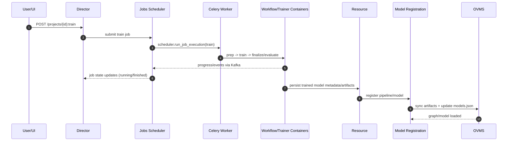
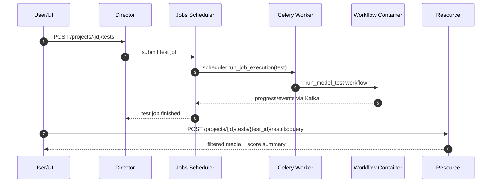
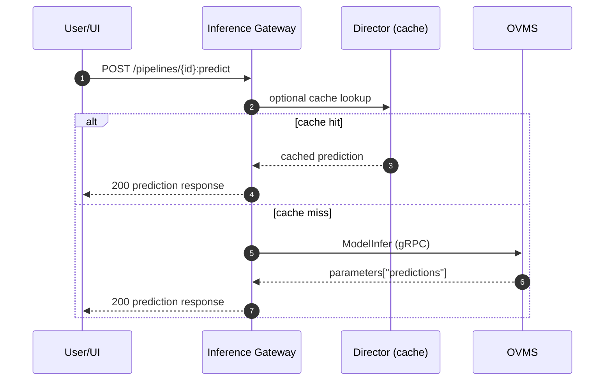

# Training, testing, and inference architecture (compose/single-node)

This document describes how training, model testing, and inference work across Geti microservices in compose deployment, including job orchestration with jobs scheduler + Celery and how trained models become available for inference.

---

## High-level architecture

At a high level, there are three user entry points:

- **Training HTTP entry point:** `interactive_ai_director` (`POST .../projects/{project_id}:train`)
- **Model test HTTP entry point:** `interactive_ai_director` (`POST .../projects/{project_id}/tests`)
- **Inference HTTP entry point:** `interactive_ai_inference_gateway` (`POST .../projects/{project_id}/pipelines/{pipeline_id}:predict`)

Core backend services involved:

- `interactive_ai_director` – validates train/test requests and submits jobs
- `interactive_ai_jobs` – scheduler/state machine; triggers execution via local executor
- `interactive_ai_jobs_celery_worker` – executes `scheduler.run_job_execution` tasks
- workflow runtime containers (`TRAIN_WORKFLOW_IMAGE`, `TRAINER_RUNTIME_IMAGE`, `MODEL_TEST_WORKFLOW_IMAGE`, etc.)
- `interactive_ai_resource` – model metadata and model-test results querying endpoints
- `interactive_ai_model_registration` – prepares graph/model artifacts and updates OVMS config
- `ovms` – serves registered pipelines for inference
- `interactive_ai_inference_gateway` – handles infer/explain APIs and calls OVMS over gRPC

### Quick sequence diagrams

---

## Training flow (request → job → celery/workflows)

### 1) HTTP training request enters Director

- Endpoint: `interactive_ai/services/director/app/communication/endpoints/training_endpoints.py`
  - `POST /api/v1/organizations/{organization_id}/workspaces/{workspace_id}/projects/{project_id}:train`
- Controller: `interactive_ai/services/director/app/communication/controllers/training_controller.py`
  - validates payload (`TrainingRestValidator`)
  - checks readiness/storage
  - resolves/creates model storage
  - submits job through `ModelTrainingJobSubmitter` + `JobsClient`

Director returns a **job id**; from this point, lifecycle is owned by jobs scheduler.

### 2) Jobs scheduler picks and schedules the job

- Runtime: `interactive_ai/services/jobs/app/scheduler/main.py`
  - starts scheduling/cancellation/deletion/recovery/resetting/revert loops
- Main loop: `interactive_ai/services/jobs/app/scheduler/loops/scheduling.py`
  - locks schedulable job
  - starts execution via `LocalExecutor().start_execution(...)`
  - sets state to `SCHEDULED`

### 3) LocalExecutor dispatches to Celery in compose mode

- `interactive_ai/services/jobs/app/scheduler/local_executor.py`
  - when `LOCAL_EXECUTOR_MODE=celery`, calls task `scheduler.run_job_execution`
- Celery entry: `interactive_ai/services/jobs/app/scheduler/celery_tasks.py`
  - `job_type == "train"` runs staged flow:
    1. prep
    2. trainer runtime
    3. finalize (conditional)
    4. evaluate

### 4) Job state transitions

- `interactive_ai/services/jobs/app/scheduler/kafka_handler.py`
  - consumes workflow events and step details
  - updates state machine (`RUNNING`, `FINISHED`, `READY_FOR_REVERT`, etc.)

---

## Model testing flow (request → job → result query)

### 1) HTTP model test request enters Director

- Endpoint: `interactive_ai/services/director/app/communication/endpoints/model_tests_endpoints.py`
  - `POST /api/v1/organizations/{organization_id}/workspaces/{workspace_id}/projects/{project_id}/tests`
- Controller: `interactive_ai/services/director/app/communication/controllers/model_test_controller.py`
  - validates test request
  - validates model/dataset constraints
  - creates `ModelTestResult`
  - submits `test` job through `ModelTestingJobSubmitter`

### 2) Scheduler/Celery executes test workflow

- Celery task supports `test` in `_MODEL_TEST_JOB_TYPES`:
  - `interactive_ai/services/jobs/app/scheduler/celery_tasks.py`
- Workflow dispatch:
  - `interactive_ai/services/jobs/app/scheduler/workflow_runner.py`
  - for `job_type == "test"`, calls `job.tasks.model_testing.run_model_test(...)`

### 3) Querying model test results

- Endpoint lives in **resource** service:
  - `interactive_ai/services/resource/app/communication/rest_endpoints/media_score_endpoints.py`
  - `POST .../projects/{project_id}/tests/{test_id}/results:query`
- Controller:
  - `interactive_ai/services/resource/app/communication/rest_controllers/media_score_controller.py`

In compose, routing for `results:query` must resolve to resource service (not director catch-all).

---

## From completed training to registered inference pipeline

After training artifacts are produced and persisted, model registration is initiated by resource layer.

### 1) Resource requests registration

- `interactive_ai/services/resource/app/communication/rest_controllers/model_controller.py`
  - `_register_model(...)` calls `ModelRegistrationClient.register(...)`
  - registers `{project_id}-active` (and task-specific names for task-chain projects)

### 2) model_registration builds and registers OVMS artifacts

- `interactive_ai/services/model_registration/app/service/model_registration.py`
  - `register_new_pipelines(...)` / `recover_pipeline(...)`
  - compose mode: prepare graph, upload artifacts, sync into OVMS models volume, update config
- `interactive_ai/services/model_registration/app/service/ovms_config.py`
  - writes `/ovms_models/models.json`
  - graph exports use graph-aware config (`graph_path`, `subconfig`)

---

## Inference flow (request → inference_gateway → OVMS)

### 1) HTTP inference request enters inference_gateway

- `interactive_ai/services/inference_gateway/main.go`
- controller chain: `pipeline.go` → `dispatcher.go` → `inference.go`
- media resolution: `app/controllers/request.go`

### 2) Cache check + infer call

- `app/service/cache.go` for optional cache lookup
- `app/usecase/infer.go`
  - computes pipeline name
  - calls `modelAccess.InferImageBytes(...)`
  - recovers model if needed
  - consumes serialized predictions from `response.parameters["predictions"]`

### 3) OVMS gRPC path

- `app/service/ovms_model_access.go`
- `app/grpc/ovms_client.go`

When graph registration is correct, OVMS returns serialized prediction payload and gateway responds with standard prediction JSON.

---

## Honest review (single-node perspective)

### What works well

- Clear service boundaries: API, scheduling, registration, serving.
- Robust scheduler state machine and retry/recovery loops.
- Compose Celery mode is practical for local/single-node orchestration.
- Graph-based serving centralizes pre/post-processing for inference.

### What is complex / fragile today

- Train/test lifecycle spans many components (Director + Jobs + Celery + workflow containers + Kafka).
- Multiple execution tracking surfaces (DB state, local registry, events) can diverge if contracts drift.
- Routing in compose can be fragile when broad Traefik rules overlap specific paths.
- Model registration/serving contracts are sensitive to small config/layout mismatches.

### Simplifications worth considering for single-node users

1. **Reduce stage handoffs** in train/test workflows where practical.
2. **Consolidate execution tracking source-of-truth** for recovery logic.
3. **Add strict preflight checks** for model registration and serving contracts.
4. **Provide a single-node compose profile** with minimal routing/runtime branches.
5. **Standardize route ownership tests** for Traefik rules to catch overlaps early.

---

## How to add external training systems

You can extend architecture so external trainers can pick up training jobs and push back trained artifacts.

### Goal

- Keep Geti as system-of-record for jobs, model metadata, and serving.
- Allow heavy training compute on external systems (e.g., over private VPN/Tailscale).

### Option A (recommended): external Celery workers

Use existing Celery seam and run additional workers outside compose host.

How:

1. Expose broker/backend only on private network.
2. External worker subscribes to `scheduler.run_job_execution`.
3. Payload includes immutable contract (project/task/model ids + artifact locations).
4. Worker trains externally and uploads outputs to expected storage.
5. Worker emits progress/completion events using existing contracts.
6. Existing resource/model_registration flow registers resulting model.

Benefits:

- Reuses current lifecycle and APIs.
- Lowest change footprint.

Requirements:

- versioned payload/event contracts
- strong network identity and secret handling
- idempotency/retry discipline for at-least-once execution

### Option B: dedicated external-training connector service

Adds a provider abstraction layer (queue/webhook/API) and cleaner SLA controls, but costs more engineering and ops.

### Suggested rollout

1. External Celery worker PoC on private network
2. Contract hardening (schema/versioning/idempotency)
3. Multi-provider routing policy
4. Optional connector service if provider count grows

---

## Practical recommendation

For single-node-first deployments, keep inference local and externalize heavy training compute. The `scheduler.run_job_execution` seam is the lowest-risk place to extend for external training.
