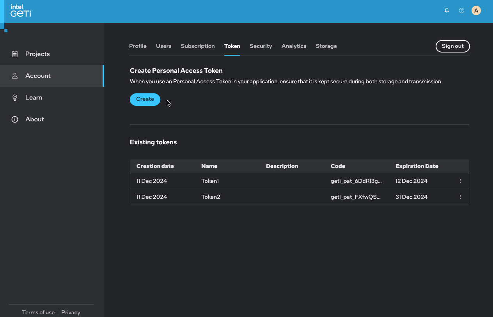
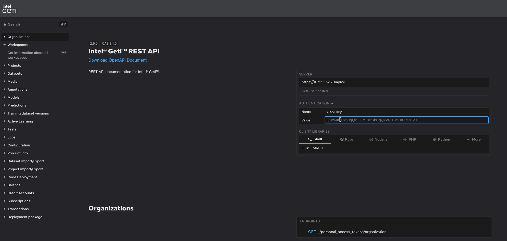
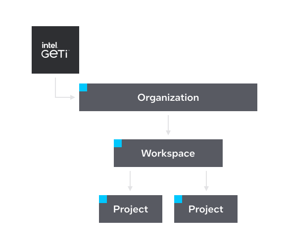
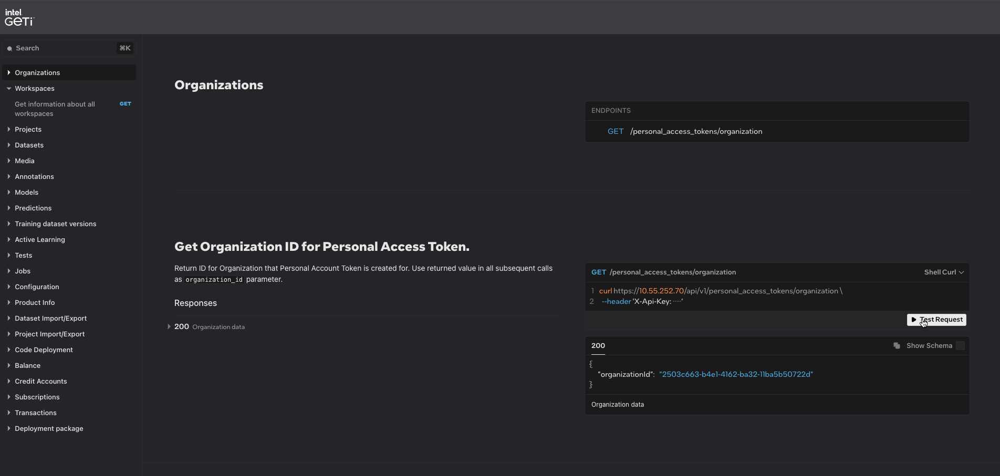
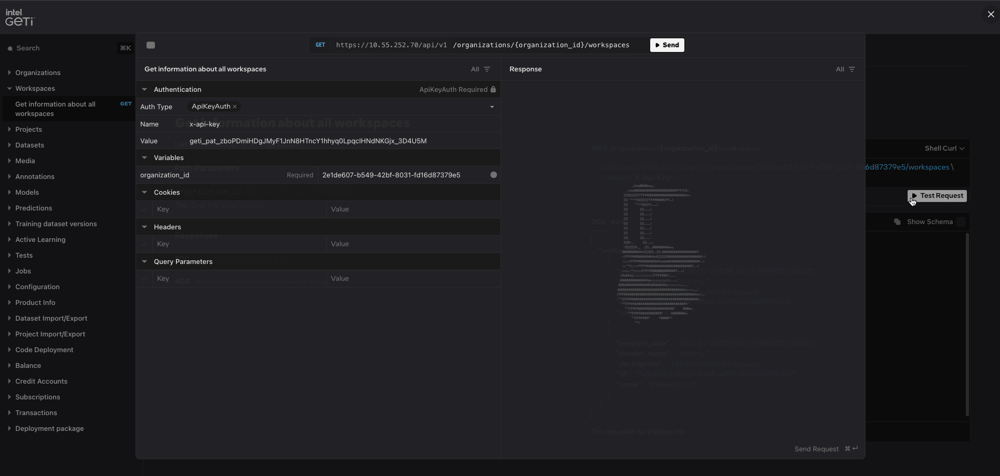
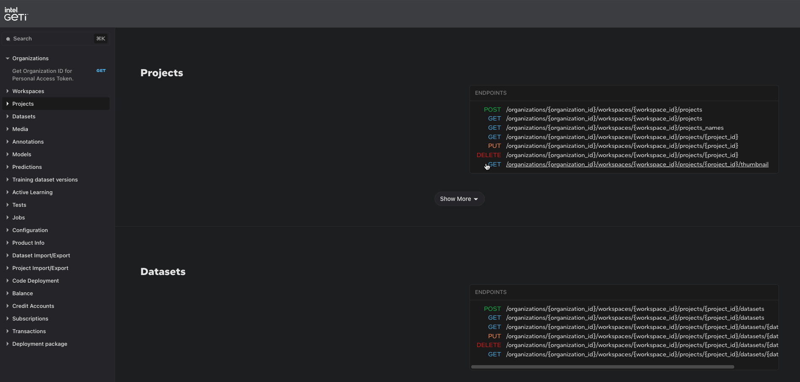
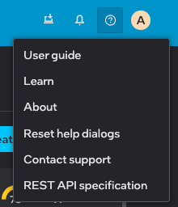

# Get Started

In this section you will be informed on how to interact programmatically with the Intel® Geti™ platform to leverage its capabilities in handling datasets, annotations, and more.

:::info[Note]
Intel® Geti™ Platform Host address:

For Intel® Geti™ SaaS please use [https://app.geti.intel.com/](https://app.geti.intel.com/) as host address, for Intel® Geti™ on-premise please use the server IP address or your DNS domain provided during the installation.

If you don’t have an Intel Geti SaaS account, you can request access by filling this form [https://geti.intel.com/request-trial](https://geti.intel.com/request-trial).
:::

## Obtain access

Before you can start interacting with the [Intel® Geti™ REST API](./redirect.md), you first must obtain access to the API by creating a Personal Access Token.

To get the token:

1. Go the Intel® Geti™ user interface.
2. Go to the **Account** section on the side panel and click on **Token** tab.
3. Click **Create**. A dialog box will prompt you to specify an expiration date for the token.

:::warning
After closing the dialog box, you will not be able to retrieve your token. So, remember to copy your token.
:::

The token generated through this method is essential for authenticating requests to the Intel® Geti™ API.

To utilize it, simply include this token in the request header of your subsequent API calls.

This is done by adding `x-api-key: <token>` to the header of each request. This process ensures that your requests are securely authenticated.

## Providing generated Personal Access Token

First off we need to provide previously generated token that is required to successfully send requests to Intel® Geti™ API.

## Obtaining the Organization and Workspace IDs

Within Intel® Geti™, projects belong to workspace, and workspace belongs to organizations. Currently, we support one workspace per organization.

To interact with a project, we need to determine the `organization_id` and `workspace_id` that it belongs to.

:::info[Note]
You can also retrieve `organization_id` and `workspace_id` from URL when using Intel® Geti™ UI.

When logging in to Intel® Geti™ you will be redirected to the main page, being the default workspace of your organization.

`<YOUR_HOST_ADDRESS>/organizations/{organization_id}/workspaces/{workspace_id}`
:::

First, we make a `GET` request to the `personal_access_tokens/organization` endpoint which will return us a response containing the ID of the organization that you have access to.

After that, we make a `GET` request to `/organizations/{organization_id}/workspaces/` in order to obtain the list of workspaces in the organization.
Choose the workspace you want to use and get the `workspace_id` from the response.

Once you complete obtaining access to REST API and organization and workspace IDs, you are successfully authenticated and ready to interact with our [REST API Specification](./redirect.md).

## REST API Tutorial

Once you successfully obtained access to the REST API and got both organization and workspace IDs, you are ready to interact with our [REST API Specification](./redirect.md).

### Example: Retrieving all projects from a workspace:

1. Navigate to [REST API Specification](./redirect.md).
2. Provide generated Personal Access Token.

3. Find `Projects` section and browse through the listed endpoints, find `GET /organizations/{organization_id}/workspaces/{workspace_id}/projects` and try it out.

#### REST API Reference

The REST API is written in [OpenAPI specification (OAS)](https://spec.openapis.org/oas/v3.1.0.html). The OAS allows for a high level of flexibility regarding tooling and plugging into your current workflow.

We provide you with the generated REST API reference, however, you can also download the specification and use your preferred tool.

All you need to do is download the OpenAPI specification (you can download a JSON file from [here](/docs/rest-api/openapi-specification) by clicking the "Download OpenAPI Document" button) and import it to your tool of choice.

Moreover, OpenAPI specification is available in the Intel® Geti™ platform. You can access it by navigating to the `{origin}/rest-api/openapi-specification` or via the Intel® Geti™ UI by clicking help menu button and selecting `REST API specification`. 

