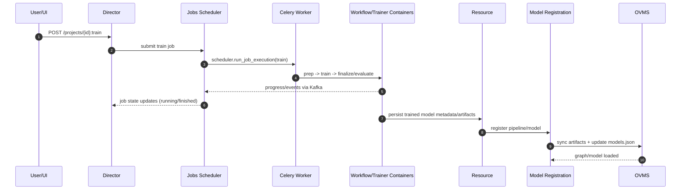
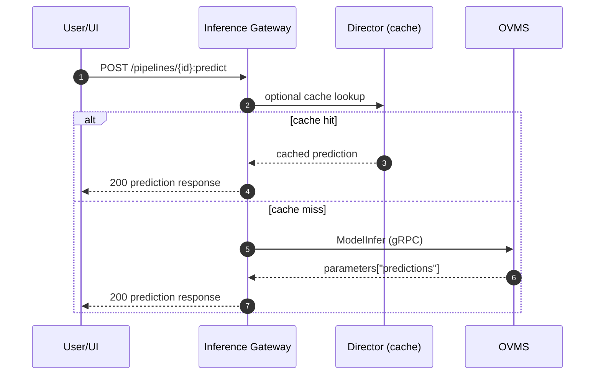

# Training and inference architecture (compose/single-node)

This document describes how training and inference work across Geti microservices in the compose deployment, including job orchestration with the jobs scheduler + Celery and how trained models become available for inference.

---

## High-level architecture

At a high level, there are two user entry points:

- **Training HTTP entry point:** `interactive_ai_director` (`POST .../projects/{project_id}:train`)
- **Inference HTTP entry point:** `interactive_ai_inference_gateway` (`POST .../projects/{project_id}/pipelines/{pipeline_id}:predict` and related endpoints)

Core backend services involved:

- `interactive_ai_director` – validates training requests and submits jobs
- `interactive_ai_jobs` – scheduler/state machine; triggers execution via local executor
- `interactive_ai_jobs_celery_worker` – executes `scheduler.run_job_execution` tasks
- workflow runtime containers (`TRAIN_WORKFLOW_IMAGE`, `TRAINER_RUNTIME_IMAGE`, etc.) – run prep/train/finalize/evaluate stages
- `interactive_ai_resource` – persists model metadata; triggers model registration
- `interactive_ai_model_registration` – prepares graph/model artifacts and updates OVMS config
- `ovms` – serves the registered pipeline for inference
- `interactive_ai_inference_gateway` – handles infer/explain APIs and calls OVMS over gRPC

### Quick sequence diagrams

---

## Training flow (request → job → celery/workflows)

### 1) HTTP training request enters Director

Primary endpoint:

- `interactive_ai/services/director/app/communication/endpoints/training_endpoints.py`
  - `POST /api/v1/organizations/{organization_id}/workspaces/{workspace_id}/projects/{project_id}:train`

Controller path:

- `interactive_ai/services/director/app/communication/controllers/training_controller.py`
  - validates request payload (`TrainingRestValidator`)
  - checks project/task readiness and storage constraints
  - resolves/creates model storage
  - submits a training job using `ModelTrainingJobSubmitter` + `JobsClient`

Result: Director returns a **job id**, and the job is now owned by jobs scheduler.

### 2) Jobs scheduler picks and schedules the job

Scheduler runtime:

- `interactive_ai/services/jobs/app/scheduler/main.py`
  - starts control loops: scheduling, cancellation, deletion, recovery, resetting, revert-scheduling

Main scheduling loop:

- `interactive_ai/services/jobs/app/scheduler/loops/scheduling.py`
  - locks next schedulable job (`StateMachine().find_and_lock_job_for_scheduling()`)
  - starts execution via `LocalExecutor().start_execution(...)`
  - updates job to `SCHEDULED` with execution metadata

### 3) LocalExecutor dispatches to Celery in compose mode

- `interactive_ai/services/jobs/app/scheduler/local_executor.py`
  - if `LOCAL_EXECUTOR_MODE=celery`, calls Celery task `scheduler.run_job_execution`
  - stores local execution metadata in registry for scheduler/kafka handler

Celery task entry:

- `interactive_ai/services/jobs/app/scheduler/celery_tasks.py`
  - `@celery_app.task(name="scheduler.run_job_execution")`
  - for `job_type == "train"` executes staged flow:
    1. prep stage via workflow container (`_run_import_export_in_container` with `WORKFLOW_JOB_TYPE=train`)
    2. trainer runtime stage (`_run_train_trainer_container`)
    3. finalize stage (`_run_train_finalize_stage`, conditional)
    4. evaluate stage (`_run_train_evaluate_stage`)

Each stage runs as a Docker container on the same node (compose network), with session/job metadata forwarded via env vars.

### 4) Job state transitions are driven by workflow events

- `interactive_ai/services/jobs/app/scheduler/kafka_handler.py`
  - consumes workflow events and job-step updates from Kafka topics
  - updates state machine (`RUNNING`, `FINISHED`, `READY_FOR_REVERT`, etc.)
  - publishes completion/failure events

---

## From completed training to registered inference pipeline

After training artifacts are produced and persisted, model registration is initiated from the resource layer.

### 1) Resource service requests registration

- `interactive_ai/services/resource/app/communication/rest_controllers/model_controller.py`
  - `_register_model(...)` calls `ModelRegistrationClient.register(...)`
  - registers:
    - single-task: `{project_id}-active`
    - task-chain: task-specific + active pipeline registrations

### 2) model_registration builds and registers OVMS artifacts

Registration service:

- `interactive_ai/services/model_registration/app/service/model_registration.py`
  - `register_new_pipelines(...)` / `recover_pipeline(...)`
  - in compose mode:
    - uses `ModelConverter.prepare_graph(...)`
    - uploads artifacts to S3-compatible storage
    - syncs model directory into OVMS model volume
    - updates OVMS config via `OvmsConfigManager.add_model(...)`

Config management:

- `interactive_ai/services/model_registration/app/service/ovms_config.py`
  - writes `/ovms_models/models.json`
  - for graph exports, writes graph-aware config (`graph_path`, `subconfig`)
  - preserves graph layout needed by session calculators

---

## Inference flow (request → inference_gateway → OVMS)

### 1) HTTP inference request enters inference_gateway

Entrypoint and route wiring:

- `interactive_ai/services/inference_gateway/main.go`
  - creates controllers/usecases/services
  - handles `.../pipelines/:pipeline_id` requests

Controller path:

- `app/controllers/pipeline.go` → `app/controllers/dispatcher.go` → `app/controllers/inference.go`

Request processing:

- `app/controllers/request.go`
  - resolves media bytes from upload or existing dataset media

### 2) Cache check + inference execution

- `app/service/cache.go`
  - optional cache lookup via Director for latest predictions

- `app/usecase/infer.go`
  - builds `pipelineName = {project_id}-{model_id}`
  - invokes `modelAccess.InferImageBytes(...)`
  - if model not ready: `TryRecoverModel(...)` (OVMS readiness polling)
  - expects serialized prediction payload from `response.parameters["predictions"]`

### 3) OVMS gRPC call

- `app/service/ovms_model_access.go`
- `app/grpc/ovms_client.go`

Behavior:

- reads model metadata
- detects mediapipe graph mode
- constructs proper request format for graph path
- sends `ModelInfer` to OVMS (`ovms:9000`)

When graph registration is correct, OVMS returns serialized prediction payload in parameters and inference gateway responds with normal Geti prediction JSON.

---

## Honest review (single-node perspective)

### What works well

- Strong microservice separation of concerns (director vs scheduler vs registration vs serving).
- Job scheduler loops and state machine provide robustness against partial failures.
- Celery-backed execution in compose is practical for local/single-node orchestration.
- OVMS graph-based serving allows task-specific preprocessing/postprocessing centrally.

### What is complex / fragile today

- Training path spans many services + Kafka + Celery + transient workflow containers; debugging requires cross-service logs.
- There are multiple “control planes” (jobs DB state, local executor registry, Kafka events) that must stay consistent.
- Small contract drift (OVMS config schema, graph layout, infer request format) can break inference in non-obvious ways.
- Compose single-node still carries some abstractions designed for larger distributed deployments.

### Simplifications worth considering for single-node users

1. **Consolidate training orchestration boundaries**
   - keep Director API + Jobs scheduler, but reduce stage handoffs where possible (fewer container hops).

2. **Single source of truth for execution tracking**
   - reduce dependence on in-memory local executor registry for critical recovery decisions.

3. **Stronger registration contract checks**
   - preflight validation that a pipeline is graph-loadable in OVMS before marking model active.

4. **Unified observability bundle**
   - one correlation id carried through Director → Jobs → Celery task → workflow containers → registration.

5. **Opinionated “single-node mode” profile**
   - ship defaults that disable unneeded distributed-era branches and simplify ops.

---

## How to add external training systems

You can extend architecture so external trainers can pick up training jobs and push back trained artifacts.

### Goal

- Keep Geti as system-of-record for jobs, model metadata, and serving.
- Allow training compute to run externally (on separate machines/clusters), potentially connected over private network (e.g., Tailscale/VPN).

### Option A (recommended): external Celery workers

Use the existing Celery abstraction, but allow workers outside the compose host.

How:

1. Expose broker/backend securely (Redis/Kafka-facing components) only on private network.
2. External worker runs compatible image/code and subscribes to `scheduler.run_job_execution`.
3. Job payload contains immutable training contract:
   - project/task/model ids
   - dataset/artifact locations (S3 presigned URLs or scoped credentials)
   - expected output artifact manifest
4. External worker executes training and uploads outputs to expected storage location.
5. Worker emits completion/failure + step progress events (same Kafka topics/contracts currently consumed by jobs scheduler).
6. Existing resource/model_registration path registers resulting model.

Benefits:

- Reuses current job lifecycle semantics.
- Minimal change to API surface.
- Lets users scale training independently from serving node.

Risks / requirements:

- strict versioned payload contract between scheduler and workers
- secure network identity + secret distribution
- idempotency and retry behavior for at-least-once task delivery

### Option B: explicit “external training connector” service

Introduce an internal service that bridges jobs to external providers (queue/webhook/api). This can provide clearer SLA, auth, and provider abstraction but is more new infrastructure than Option A.

### Suggested phased implementation

1. **Phase 1:** external Celery worker PoC on VPN/Tailscale with one trainer backend.
2. **Phase 2:** artifact + event contract hardening (schema/versioning/idempotency).
3. **Phase 3:** multi-provider routing policy (per project/template/hardware).
4. **Phase 4:** optional connector service if provider diversity grows.

---

## Practical recommendation

For single-node-first deployments, keep inference local and externalize only heavy training compute. The architecture already has the right seam at job execution (`scheduler.run_job_execution`), so extending that seam is lower-risk than redesigning Director/Resource APIs.
